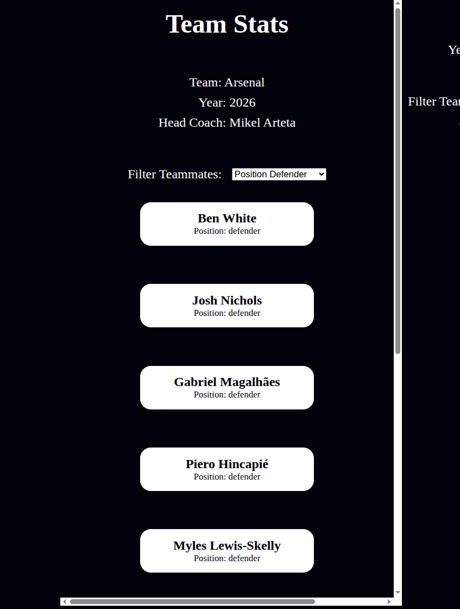

# ⚽ Arsenal Team Cards 🟥⬜


An interactive **Football Team Cards** web application that displays **Arsenal FC’s squad** using clean HTML, modern CSS, and vanilla JavaScript.  
Users can filter players by position and view team statistics in a responsive, card-based interface.

---

## 🚀 Live Demo 📡

👉 **[Live Demo: ](https://karianjahi.github.io/arsenal-team-cards/)** 📡 🌍  
Hosted on **GitHub Pages** — open it in your browser and start exploring instantly!

---


## 🧠 Project Overview

This project dynamically renders football player cards from a JavaScript object and allows users to:

- View **team information** (club, year, head coach)
- Filter players by **position**
- See the **captain highlighted**
- Enjoy a **responsive UI** across devices

Built with simplicity and clarity in mind—no frameworks, just the fundamentals 💪

---

## 🛠️ Tech Stack

- 🧱 **HTML5** – semantic structure  
- 🎨 **CSS3** – custom properties, grid & flexbox  
- ⚙️ **JavaScript (ES6)** – data handling, DOM manipulation  
- 🌐 **GitHub Pages** – deployment  

---

## ✨ Features

- 🔄 Shuffle players randomly on load  
- 🧩 Filter by position:
  - Goalkeeper 🧤  
  - Defender 🛡️  
  - Midfielder 🎯  
  - Forward ⚡  
- 👑 Captain clearly labeled  
- 📱 Fully responsive layout  
- 🎨 Dark-themed, card-based UI  

---

## 📂 Project Structure

```text
arsenal-team-cards/
├── images
   ├── UI.png 
├── index.html      # App structure
├── styles.css      # Styling and responsiveness
├── script.js       # Team data & interactivity
├── README.md       # Project documentation
├── LICENSE         # MIT License
└── .gitignore
```

---

## ⚙️ How It Works (High Level)

1. Team and player data are stored in a JavaScript object.
2. Players are **shuffled** for variety on each reload.
3. A dropdown allows filtering players by position.
4. Cards are dynamically rendered into the DOM.
5. CSS Grid & Flexbox handle layout and responsiveness.

---

## 🖼️ Preview & Responsive Design

This application is built with a **mobile-first, responsive design** approach to ensure a smooth and consistent user experience across devices.  
By combining **CSS Grid** and **Flexbox**, the layout adapts gracefully to different screen sizes without sacrificing readability or usability.

### 💻 Desktop View


On larger screens, player cards are displayed in a **two-column grid**, allowing users to view more content at a glance while keeping the interface clean and balanced.

### 📱 Mobile View


On smaller screens, the layout automatically adjusts by:
- Switching to a **single-column card layout**
- Stacking team statistics vertically
- Reducing padding and spacing for **touch-friendly interaction**

This ensures the app remains intuitive, accessible, and visually appealing on both desktop and mobile devices.

---

## 🧪 Getting Started Locally

```bash
# Clone the repository
git clone https://github.com/karianjahi/arsenal-team-cards.git

# Navigate into the project
cd arsenal-team-cards

# Open in browser
open index.html
```

No build tools. No dependencies. Just open and go 🚀

---

## 🧩 Possible Improvements

- 🔍 Search by player name  
- 🖼️ Player images & stats  
- 🎯 Animations on filter change  
- 🏆 Multiple teams support  

---

## 📜 License

This project is licensed under the **MIT License**.  
Feel free to use, modify, and share 👍

---

## 👤 Author

**Joseph Karianjahi Njeri**  
💻 Frontend Developer | ⚽ Football Enthusiast  

---

⭐ If you like this project, consider giving it a star!